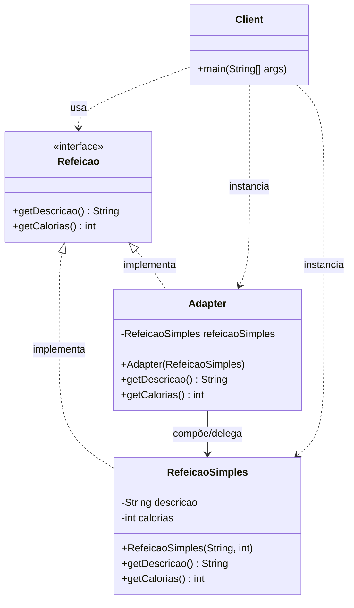

```mermaid
classDiagram
    %% Definição da Interface
    class Refeicao {
        <<interface>>
        +getDescricao() String
        +getCalorias() int
    }

    %% A classe concreta que já funciona corretamente
    class RefeicaoSimples {
        -String descricao
        -int calorias
        +RefeicaoSimples(String, int)
        +getDescricao() String
        +getCalorias() int
    }

    %% O Adapter (neste caso, desnecessário)
    class Adapter {
        -RefeicaoSimples refeicaoSimples
        +Adapter(RefeicaoSimples)
        +getDescricao() String
        +getCalorias() int
    }

    %% O Cliente que usa as classes
    class Client {
        +main(String[] args)
    }

    %% Relacionamentos
    Refeicao <|.. RefeicaoSimples : implementa
    Refeicao <|.. Adapter : implementa
    
    %% O ponto chave do antipattern: O Adapter compõe algo que já é do tipo da interface
    Adapter --> RefeicaoSimples : compõe/delega

    %% Dependências do Cliente
    Client ..> Refeicao : usa
    Client ..> RefeicaoSimples : instancia
    Client ..> Adapter : instancia
```