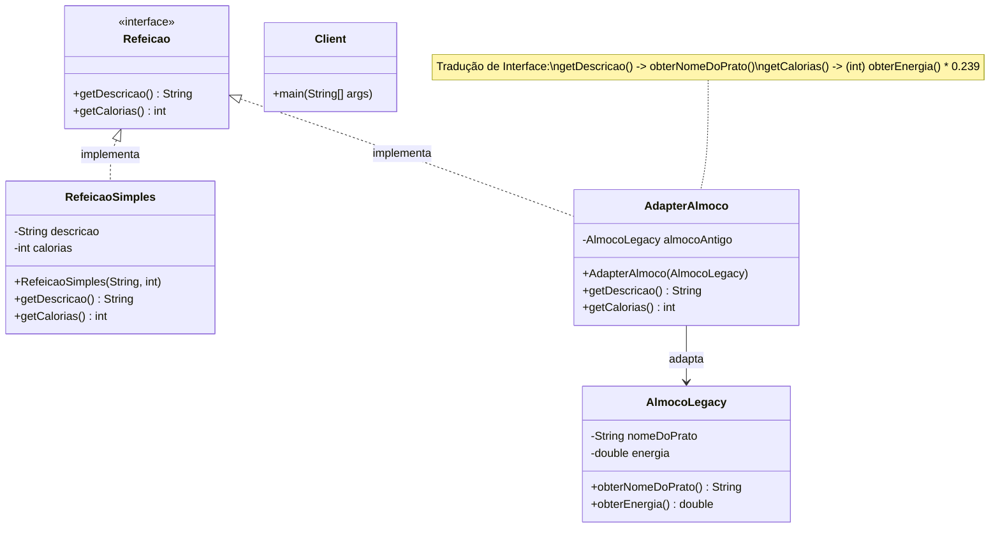

```mermaid
classDiagram
    %% Interface Alvo (Target)
    class Refeicao {
        <<interface>>
        +getDescricao() String
        +getCalorias() int
    }

    %% Implementação Padrão
    class RefeicaoSimples {
        -String descricao
        -int calorias
        +RefeicaoSimples(String, int)
        +getDescricao() String
        +getCalorias() int
    }

    %% Classe Legada (Adaptee)
    %% Nota: No código há uma mistura entre AlmocoLegacy e AlmocoAntigo. 
    %% Representei como AlmocoLegacy (baseado no nome do arquivo).
    class AlmocoLegacy {
        -String nomeDoPrato
        -double energia
        +obterNomeDoPrato() String
        +obterEnergia() double
    }

    %% O Adaptador (Adapter)
    class AdapterAlmoco {
        -AlmocoLegacy almocoAntigo
        +AdapterAlmoco(AlmocoLegacy)
        +getDescricao() String
        +getCalorias() int
    }

    %% Cliente
    class Client {
        +main(String[] args)
    }

    %% Relacionamentos
    Refeicao <|.. RefeicaoSimples : implementa
    Refeicao <|.. AdapterAlmoco : implementa
    
    %% O Adapter envolve (compõe) a classe legada
    AdapterAlmoco --> AlmocoLegacy : adapta

    %% Notas explicativas no diagrama
    note for AdapterAlmoco "Tradução de Interface:\ngetDescricao() -> obterNomeDoPrato()\ngetCalorias() -> (int) obterEnergia() * 0.239"

```