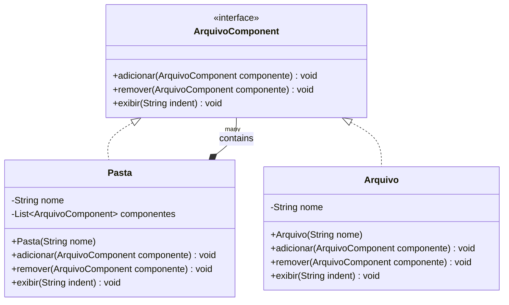

```mermaid
classDiagram
    class ArquivoComponent {
        <<interface>>
        +adicionar(ArquivoComponent componente) void
        +remover(ArquivoComponent componente) void
        +exibir(String indent) void
    }

    class Pasta {
        -String nome
        -List~ArquivoComponent~ componentes
        +Pasta(String nome)
        +adicionar(ArquivoComponent componente) void
        +remover(ArquivoComponent componente) void
        +exibir(String indent) void
    }

    class Arquivo {
        -String nome
        +Arquivo(String nome)
        +adicionar(ArquivoComponent componente) void
        +remover(ArquivoComponent componente) void
        +exibir(String indent) void
    }

    ArquivoComponent <|.. Pasta
    ArquivoComponent <|.. Arquivo
    Pasta *-- "many" ArquivoComponent : contains
```