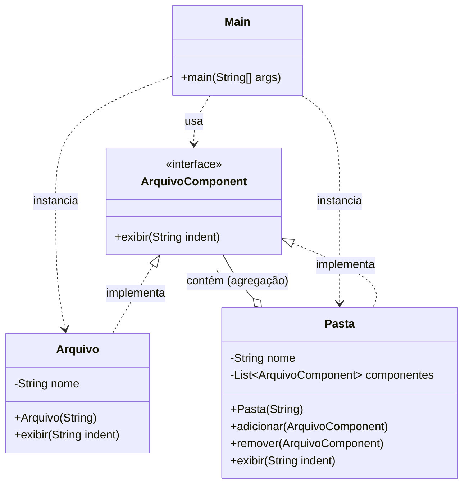

```mermaid
classDiagram
    %% Componente (Interface Comum)
    class ArquivoComponent {
        <<interface>>
        +exibir(String indent)
    }

    %% Folha (Leaf) - O objeto indivisível
    class Arquivo {
        -String nome
        +Arquivo(String)
        +exibir(String indent)
    }

    %% Composto (Composite) - O contêiner que pode ter filhos
    class Pasta {
        -String nome
        -List~ArquivoComponent~ componentes
        +Pasta(String)
        +adicionar(ArquivoComponent)
        +remover(ArquivoComponent)
        +exibir(String indent)
    }

    %% Cliente
    class Main {
        +main(String[] args)
    }

    %% Relacionamentos de Herança/Implementação
    ArquivoComponent <|.. Arquivo : implementa
    ArquivoComponent <|.. Pasta : implementa

    %% O Relacionamento CHAVE do Composite:
    %% A Pasta contém uma lista de Componentes (que podem ser Arquivos ou outras Pastas)
    Pasta o-- "*" ArquivoComponent : contém (agregação)

    %% Dependências do Cliente
    Main ..> ArquivoComponent : usa
    Main ..> Pasta : instancia
    Main ..> Arquivo : instancia

```