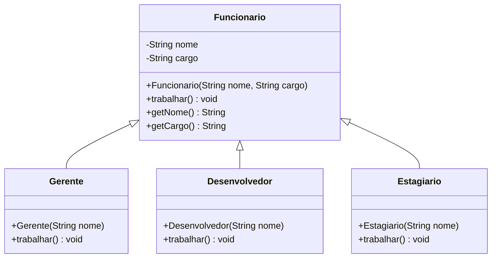

```mermaid

classDiagram
    direction TB

    class Funcionario {
        -String nome
        -String cargo
        +Funcionario(String nome, String cargo)
        +trabalhar() void
        +getNome() String
        +getCargo() String
    }

    class Gerente {
        +Gerente(String nome)
        +trabalhar() void
    }

    class Desenvolvedor {
        +Desenvolvedor(String nome)
        +trabalhar() void
    }

    class Estagiario {
        +Estagiario(String nome)
        +trabalhar() void
    }

    Funcionario <|-- Gerente
    Funcionario <|-- Desenvolvedor
    Funcionario <|-- Estagiario

```
