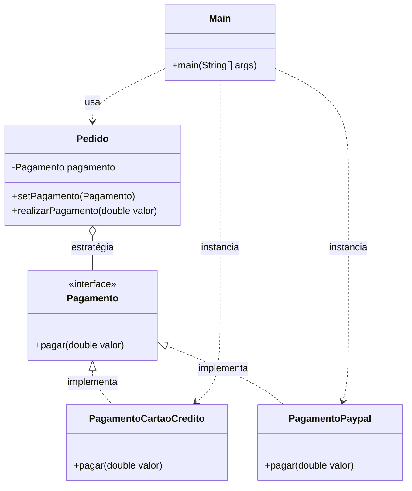

```mermaid
classDiagram
    %% A Interface Strategy (Estratégia)
    class Pagamento {
        <<interface>>
        +pagar(double valor)
    }

    %% Estratégias Concretas
    class PagamentoCartaoCredito {
        +pagar(double valor)
    }

    class PagamentoPaypal {
        +pagar(double valor)
    }

    %% O Contexto (Context)
    class Pedido {
        -Pagamento pagamento
        +setPagamento(Pagamento)
        +realizarPagamento(double valor)
    }

    %% Cliente
    class Main {
        +main(String[] args)
    }

    %% Relacionamentos
    %% As estratégias concretas implementam a interface comum
    Pagamento <|.. PagamentoCartaoCredito : implementa
    Pagamento <|.. PagamentoPaypal : implementa

    %% O Contexto COMPÕE (tem uma) Estratégia
    %% A seta de agregação (o--) mostra que o Pedido mantém uma referência para a interface
    Pedido o-- Pagamento : estratégia

    %% O Cliente define qual estratégia usar
    Main ..> Pedido : usa
    Main ..> PagamentoCartaoCredito : instancia
    Main ..> PagamentoPaypal : instancia
```