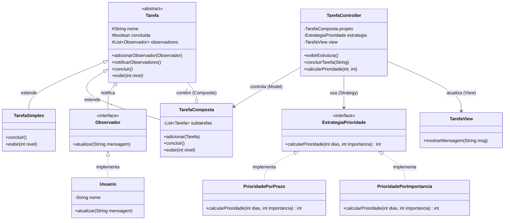

```mermaid
classDiagram
    %% ---------------------------------------------------------
    %% CAMADA MODEL (Lógica de Negócios e Dados)
    %% ---------------------------------------------------------

    %% Padrão COMPOSITE (Estrutura da Tarefa)
    class Tarefa {
        <<abstract>>
        #String nome
        #boolean concluida
        #List~Observador~ observadores
        +adicionarObservador(Observador)
        +notificarObservadores()
        +concluir()*
        +exibir(int nivel)*
    }

    class TarefaSimples {
        +concluir()
        +exibir(int nivel)
    }

    class TarefaComposta {
        -List~Tarefa~ subtarefas
        +adicionar(Tarefa)
        +concluir()
        +exibir(int nivel)
    }

    %% Padrão OBSERVER (Notificação)
    class Observador {
        <<interface>>
        +atualizar(String mensagem)
    }

    class Usuario {
        -String nome
        +atualizar(String mensagem)
    }

    %% Padrão STRATEGY (Cálculo de Prioridade)
    class EstrategiaPrioridade {
        <<interface>>
        +calcularPrioridade(int dias, int importancia) int
    }

    class PrioridadePorPrazo {
        +calcularPrioridade(int dias, int importancia) int
    }

    class PrioridadePorImportancia {
        +calcularPrioridade(int dias, int importancia) int
    }

    %% ---------------------------------------------------------
    %% CAMADA VIEW (Interface com Usuário)
    %% ---------------------------------------------------------
    class TarefaView {
        +mostrarMensagem(String msg)
    }

    %% ---------------------------------------------------------
    %% CAMADA CONTROLLER (Orquestração)
    %% ---------------------------------------------------------
    class TarefaController {
        -TarefaComposta projeto
        -EstrategiaPrioridade estrategia
        -TarefaView view
        +exibirEstrutura()
        +concluirTarefa(String)
        +calcularPrioridade(int, int)
    }

    %% ---------------------------------------------------------
    %% RELACIONAMENTOS
    %% ---------------------------------------------------------

    %% Relações Composite
    Tarefa <|-- TarefaSimples : estende
    Tarefa <|-- TarefaComposta : estende
    TarefaComposta o-- "*" Tarefa : contém (Composite)

    %% Relações Observer
    Observador <|.. Usuario : implementa
    Tarefa o-- "*" Observador : notifica

    %% Relações Strategy
    EstrategiaPrioridade <|.. PrioridadePorPrazo : implementa
    EstrategiaPrioridade <|.. PrioridadePorImportancia : implementa

    %% Relações MVC (Controller integrando tudo)
    TarefaController --> TarefaComposta : controla (Model)
    TarefaController --> EstrategiaPrioridade : usa (Strategy)
    TarefaController --> TarefaView : atualiza (View)
```