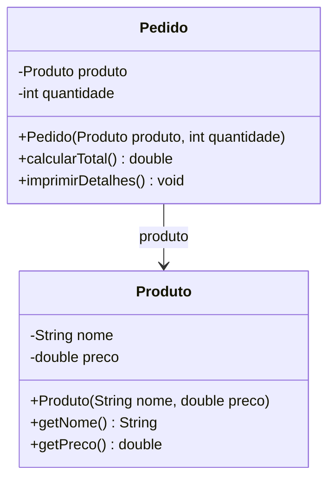

```mermaid
classDiagram
    direction TB

    class Produto {
        -String nome
        -double preco
        +Produto(String nome, double preco)
        +getNome() String
        +getPreco() double
    }

    class Pedido {
        -Produto produto
        -int quantidade
        +Pedido(Produto produto, int quantidade)
        +calcularTotal() double
        +imprimirDetalhes() void
    }

    Pedido --> Produto : produto

```