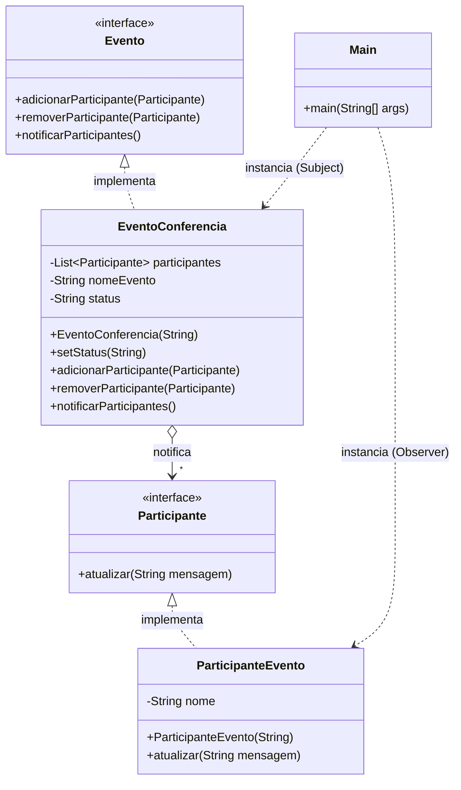

```mermaid

classDiagram
    %% Subject (Observable) Interface
    class Evento {
        <<interface>>
        +adicionarParticipante(Participante)
        +removerParticipante(Participante)
        +notificarParticipantes()
    }

    %% Concrete Subject (O que muda de estado)
    class EventoConferencia {
        -List~Participante~ participantes
        -String nomeEvento
        -String status
        +EventoConferencia(String)
        +setStatus(String)
        +adicionarParticipante(Participante)
        +removerParticipante(Participante)
        +notificarParticipantes()
    }

    %% Observer Interface
    class Participante {
        <<interface>>
        +atualizar(String mensagem)
    }

    %% Concrete Observer (Quem recebe a notificação)
    class ParticipanteEvento {
        -String nome
        +ParticipanteEvento(String)
        +atualizar(String mensagem)
    }

    %% Cliente
    class Main {
        +main(String[] args)
    }

    %% Relacionamentos de Implementação
    Evento <|.. EventoConferencia : implementa
    Participante <|.. ParticipanteEvento : implementa

    %% O Coração do Observer: Agregação
    %% O EventoConferencia "tem" vários Participantes (apontando para a interface)
    EventoConferencia o--> "*" Participante : notifica

    %% Dependências do Main
    Main ..> EventoConferencia : instancia (Subject)
    Main ..> ParticipanteEvento : instancia (Observer)

```